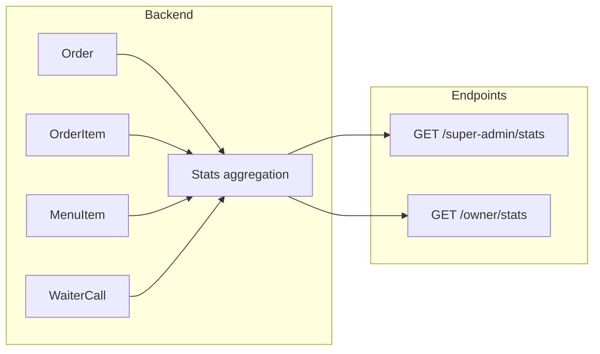

# Statistics for showing client value

## Goals

- **Platform-level:** Numbers you can show new clients (“our app in numbers”) — super-admin dashboard and/or a shareable stats view.
- **Per-restaurant:** Each owner sees their own performance (orders, revenue, waiter calls) so they feel the benefit.
- **Messages:** “Makes life easier” (fewer waiter runs, AI answers guests) and “profitable” (orders, revenue).

---

## Which statistics to collect

### 1. Revenue and orders (profitable)

| Stat                                              | Scope                     | Source                                                                                                                                    |
| ------------------------------------------------- | ------------------------- | ----------------------------------------------------------------------------------------------------------------------------------------- |
| **Total revenue**                                 | Platform + per-restaurant | Sum `OrderItem.quantity * MenuItem.price` for orders in period. Use `Order.createdAt` for date filter; join Order → OrderItem → MenuItem. |
| **Orders count** (today / this week / this month) | Both                      | Already have `Order`; add `ordersThisWeek`, `ordersThisMonth` where useful.                                                               |
| **Average order value (AOV)**                     | Both                      | Revenue ÷ order count for the period.                                                                                                     |
| **Items per order**                               | Both                      | Count OrderItems per Order, average.                                                                                                      |

Revenue is the strongest “profitable” proof. Your [MenuItem](backend/src/models/MenuItem.ts) has `price` and [OrderItem](backend/src/models/OrderItem.ts) has `quantity`, so revenue is derivable without schema changes.

### 2. Waiter calls (life easier)

| Stat                                          | Scope    | Source                                                                              |
| --------------------------------------------- | -------- | ----------------------------------------------------------------------------------- |
| **Waiter calls handled** (total or in period) | Both     | [WaiterCall](backend/src/models/WaiterCall.ts): count where `status === 'handled'`. |
| **Average response time**                     | Both     | For handled calls: `handledAt - createdAt` (e.g. in minutes).                       |
| **Open waiter calls**                         | Platform | Already in [super-admin stats](backend/src/routes/superAdmin.ts) (line 146).        |

These support the “less running around” story.

### 3. AI chat usage (life easier)

| Stat                                               | Scope | Source                                                  |
| -------------------------------------------------- | ----- | ------------------------------------------------------- |
| **Chat requests / sessions** (total or per period) | Both  | Not stored today. Add lightweight tracking (see below). |

Useful for “guests get answers without bothering staff.” Optional but high impact for sales.

### 4. Already available

- **Total restaurants** — already in super-admin stats.
- **Total orders / orders today** — already in super-admin stats.
- **Total feedback** — already in super-admin stats.

---

## How to collect

### Backend

**A. Platform stats (super-admin)**  

- **Extend** `GET /api/super-admin/stats` in [backend/src/routes/superAdmin.ts](backend/src/routes/superAdmin.ts):
  - Add **totalRevenue**: aggregation over `Order` (filter by `createdAt` if you want “all time” or “this month”), join `OrderItem` and `MenuItem`, sum `quantity * price`. Use MongoDB aggregation pipeline (`$lookup` OrderItem → MenuItem, then `$group`).
  - Add **ordersThisWeek**, **ordersThisMonth** (count with `createdAt` in range).
  - Add **waiterCallsHandled** (count `WaiterCall` with `status: 'handled'`), optionally **waiterCallsHandledThisWeek**.
  - Optionally add **avgWaiterResponseMinutes** from handled calls (`$group` with `$avg` of difference).
- **Indexes:** Ensure `Order(restaurantId, createdAt)`, `OrderItem(orderId)`, `WaiterCall(restaurantId, status, handledAt)` are indexed (some may already exist via refs).

**B. Per-restaurant stats (owner)**  

- **New endpoint** `GET /api/restaurants/:restaurantId/stats` (or `GET /api/owner/stats` that uses `req.ownerRestaurantId`):
  - Protect with `authenticateOwner` and ensure `restaurantId` matches `req.ownerRestaurantId`.
  - Query params: e.g. `period=day|week|month` or fixed ranges (today, this week, this month).
  - Return: orders (count), revenue, AOV, items per order, waiter calls (total, handled, avg response time), optionally chat sessions in period.
  - Same aggregation pattern as platform: Order → OrderItem → MenuItem for revenue; WaiterCall for calls.

**C. Chat usage (optional)**  

- **Option 1 (simplest):** In [backend/src/routes/chat.ts](backend/src/routes/chat.ts), after a successful `menuChat` call, increment a counter. E.g. add a field `chatRequestsCount` on [Restaurant](backend/src/models/Restaurant.ts) and `$inc: { chatRequestsCount: 1 }`, or a small `ChatRequest` model with `{ restaurantId, createdAt }` for per-period counts.
- **Option 2:** New model `ChatSession` or `ChatEvent`: `{ restaurantId, createdAt }`. Insert one document per POST to `/chat`. Enables “chats this week” without touching Restaurant schema.
- Then add **chatSessionsTotal** (and optionally **chatSessionsThisWeek**) to platform stats and per-restaurant stats.

**D. Date ranges**  

- Use server time (or restaurant `timezone` from [Restaurant](backend/src/models/Restaurant.ts) for per-restaurant) for “today” / “this week” / “this month” so numbers are consistent.

### Frontend

**Super-admin (show new clients)**  

- In [frontend/src/pages/SuperAdminDashboardPage.tsx](frontend/src/pages/SuperAdminDashboardPage.tsx):
  - Extend the existing `Stats` type and the stats cards (lines 345–376) to show: **Total revenue** (formatted with currency), **Orders this week**, **Waiter calls handled** (and optionally avg response time).
- If you want a **shareable “platform stats” view** for sales (e.g. public or unlisted page), add a new route and page that fetches the same (or a dedicated public) stats endpoint and displays only the high-level numbers (restaurants, orders, revenue, waiter calls handled, maybe chat sessions). That can be a separate, minimal page.

**Owner dashboard (their own value)**  

- Add an **Owner Stats** (or **Dashboard**) page under the owner layout:
  - Route: e.g. `/owner` index or `/owner/stats`.
  - Fetch `GET /api/owner/stats` or `GET /api/restaurants/:id/stats` with owner auth.
  - Show: orders (today / week / month), revenue, AOV, waiter calls handled, avg response time, optional chat usage. Same card-style UI as super-admin for consistency.
- Add a nav link in [OwnerDashboardLayout](frontend/src/layouts/OwnerDashboardLayout.tsx) (e.g. “Stats” or “Dashboard”).

### Data flow (high level)

---

## Summary

| Stat                                  | Collect how                            | Where shown                       |
| ------------------------------------- | -------------------------------------- | --------------------------------- |
| Revenue (total / period)              | Aggregate Order + OrderItem + MenuItem | Super-admin, owner stats          |
| Orders (today / week / month)         | Count Order by createdAt               | Super-admin (extend), owner stats |
| AOV, items per order                  | From same aggregation                  | Owner stats, optional super-admin |
| Waiter calls handled (+ avg response) | Count/avg WaiterCall                   | Super-admin, owner stats          |
| Chat sessions                         | Optional: counter or ChatEvent model   | Super-admin, owner stats          |

No change to Order or OrderItem schema is required. Optional: one new field on Restaurant or one new small collection for chat. All other stats are computed from existing models via aggregations and new endpoints.