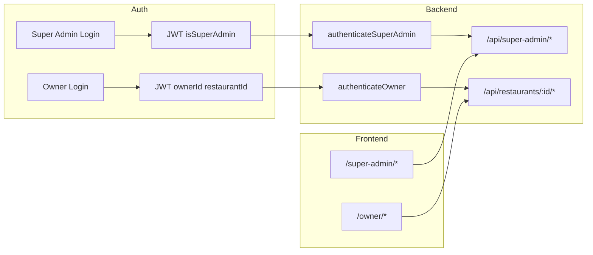

# Super Admin Page – Full Control Over All Restaurants

## Current state

- **Tenancy:** One **Restaurant** per business, one **RestaurantOwner** per restaurant (1:1). No platform-level admin exists.
- **Auth:** JWT with `ownerId` + `restaurantId`; [backend/src/middleware/auth.ts](backend/src/middleware/auth.ts) `authenticateOwner` restricts all owner APIs to that restaurant only.
- **Frontend:** Owner area under `/owner/*` (menu, settings); no super-admin routes or role.

## Architecture (high level)

---

## 1. Backend: Super-admin identity and auth

**Mechanism:** Env-based (no new DB collection). One shared password for all super-admin emails.

- **Env vars** (e.g. in `.env`):
  - `SUPER_ADMIN_EMAILS` – comma-separated list (e.g. `you@example.com,admin@platform.com`).
  - `SUPER_ADMIN_PASSWORD` – single shared password for super-admin login.

**New auth route** in [backend/src/routes/auth.ts](backend/src/routes/auth.ts) (or a small new file mounted under `/api`):

- `POST /api/auth/super-admin/login`  
  - Body: `{ email, password }`.  
  - Check `email` (normalized) is in `SUPER_ADMIN_EMAILS` and `password === SUPER_ADMIN_PASSWORD`.  
  - If valid: issue JWT with `{ isSuperAdmin: true, superAdminEmail: email }` (no `ownerId`/`restaurantId`), e.g. 12h expiry.  
  - Return `{ token, superAdmin: { email } }`.

**New middleware** in [backend/src/middleware/auth.ts](backend/src/middleware/auth.ts):

- `authenticateSuperAdmin(req, res, next)`:  
  - Verify Bearer JWT; require `decoded.isSuperAdmin === true`.  
  - Set `(req as any).superAdminEmail = decoded.superAdminEmail` and call `next()`; otherwise 401.

Super-admin and owner JWTs are distinct: super-admin token must not be accepted by `authenticateOwner`, and owner token must not be accepted by `authenticateSuperAdmin`.

---

## 2. Backend: Super-admin API routes

**New router** e.g. [backend/src/routes/superAdmin.ts](backend/src/routes/superAdmin.ts), mounted under `/api` with prefix (e.g. `app.use('/api', superAdminRoutes)` and router uses `router.get('/super-admin/...')` or mount at `app.use('/api/super-admin', authenticateSuperAdmin, superAdminRouter)` so all routes require super-admin).

Suggested endpoints:

| Method | Path                               | Purpose                                                                                                                                                                                             |
| ------ | ---------------------------------- | --------------------------------------------------------------------------------------------------------------------------------------------------------------------------------------------------- |
| GET    | `/api/super-admin/restaurants`     | List all restaurants with owner email. Query: `?search=`, `?page=`, `?limit=` (optional pagination). Return array of `{ restaurant, ownerEmail }` (owner from `RestaurantOwner` by `restaurantId`). |
| GET    | `/api/super-admin/restaurants/:id` | Single restaurant by ID + owner (email, createdAt). 404 if not found.                                                                                                                               |
| GET    | `/api/super-admin/stats`           | Platform stats: total restaurants, total orders (count from [Order](backend/src/models/Order.ts)), optional: orders today, open waiter calls.                                                       |
| PATCH  | `/api/super-admin/restaurants/:id` | Update any restaurant (same updatable fields as owner PATCH in [backend/src/routes/menu.ts](backend/src/routes/menu.ts) lines 131+).                                                                |
| DELETE | `/api/super-admin/restaurants/:id` | Delete restaurant and its owner (and optionally cascade: menu categories/items, tables, orders, waiter calls – or leave orphaned; recommend cascade delete for clean state).                        |

**Optional but recommended:** Add `isSuspended?: boolean` to [Restaurant](backend/src/models/Restaurant.ts) (default `false`). Then:

- Add `PATCH /api/super-admin/restaurants/:id/suspend` (body `{ suspended: true \| false }`) or include `isSuspended` in the general PATCH above.
- In public/owner flows that “use” the restaurant (menu, orders, kitchen), enforce that non-suspended restaurants only (e.g. in menu by slug, order creation, etc.) so super admin can effectively “disable” a business without deleting.

Implement list by: `Restaurant.find(...).lean()` and for each (or one aggregation) join `RestaurantOwner` on `restaurantId` to attach `ownerEmail`. Stats: `Restaurant.countDocuments()`, `Order.countDocuments()`, etc.

---

## 3. Frontend: Super-admin auth and route protection

**Token storage:** Use a **separate** storage key from the owner (e.g. `ai-waiter:super-admin-token`) so super-admin and owner sessions do not overwrite each other.

**Options:**

- **A)** New **SuperAdminAuthContext** (separate from [AuthContext](frontend/src/components/AuthContext.tsx)): holds `superAdminToken`, `superAdmin` (e.g. `{ email }`), `loginSuperAdmin(email, password)`, `logoutSuperAdmin`, and `loading`. On mount, if token exists, call a new backend endpoint `GET /api/auth/super-admin/me` that validates the JWT and returns `{ superAdmin: { email } }` (optional but improves UX).
- **B)** Reuse a single AuthContext with a union state (owner **or** superAdmin). More refactor; A is simpler and keeps owner flow untouched.

Recommend **A**: minimal changes to existing owner flow; super-admin has its own login and layout.

**Routes** in [frontend/src/App.tsx](frontend/src/App.tsx):

- `GET /super-admin/login` → Super admin login page (form: email + password → `POST /api/auth/super-admin/login`, store token, redirect to `/super-admin`).
- Wrap super-admin dashboard in a **SuperAdminRoute** that checks for super-admin token (and optionally validates via `/api/auth/super-admin/me`); if missing, redirect to `/super-admin/login`.
- Under the protected segment: `/super-admin` (dashboard index), `/super-admin/restaurants/:id` (detail/edit) if you want a dedicated detail page, or keep everything on one page with modals/drawers.

---

## 4. Frontend: Super-admin dashboard page(s)

**Single main page** at `/super-admin` (with optional detail view or side panel) containing:

1. **Header**
  - Title “Super Admin” (or “Platform Admin”), logged-in email, **Sign out** (clear super-admin token and redirect to `/super-admin/login`).
2. **Stats cards** (top)
  - Total restaurants, total orders (and optionally orders today / open waiter calls if backend exposes them). Fetch from `GET /api/super-admin/stats`.
3. **Restaurants table**
  - Columns: Name, Slug, Owner email, Created (date), Status (e.g. “Active” / “Suspended” if `isSuspended` exists), Actions.  
  - **Search/filter** by name or slug (client-side or pass `?search=` to list API).  
  - **Actions per row:**  
    - **View/Edit** – open detail or inline form (load `GET /api/super-admin/restaurants/:id`, save via `PATCH /api/super-admin/restaurants/:id`).  
    - **Suspend/Resume** – toggle (if you added `isSuspended`).  
    - **Delete** – confirm dialog then `DELETE /api/super-admin/restaurants/:id`, then refresh list.  
    - **Links:** “Guest menu” → `/restaurant/:slug/menu`, “Kitchen” → `/kitchen/:restaurantId`, “Owner settings” → `/admin/:restaurantId` (or owner app URL with id; note owner settings require owner login so this is “open kitchen/menu” only unless you add impersonation later).
4. **Restaurant detail / edit**
  - Either a second route or a modal/drawer: show all restaurant fields (name, slug, currency, address, phone, contactEmail, description, restaurantType, timezone, openingHoursNote, tax/service charge, allowOrders, orderLeadTimeMinutes, aiInstructions, isSuspended) and save with PATCH. Owner email can be read-only here.
5. **Error and loading states**
  - Use existing patterns (e.g. [OwnerSettingsPage](frontend/src/pages/OwnerSettingsPage.tsx), [AdminMenuPage](frontend/src/pages/AdminMenuPage.tsx)): loading spinners, API error messages, validation on edit form.

Use the same API base and `apiFetch` with the super-admin token for all super-admin API calls.

---

## 5. Files to add or change (summary)

| Area                                                                 | Action                                                                                                                 |
| -------------------------------------------------------------------- | ---------------------------------------------------------------------------------------------------------------------- |
| Backend env                                                          | Document or add `SUPER_ADMIN_EMAILS`, `SUPER_ADMIN_PASSWORD` (and keep JWT_SECRET).                                    |
| [backend/src/middleware/auth.ts](backend/src/middleware/auth.ts)     | Add `authenticateSuperAdmin`.                                                                                          |
| [backend/src/routes/auth.ts](backend/src/routes/auth.ts)             | Add `POST /auth/super-admin/login`; optional `GET /auth/super-admin/me`.                                               |
| [backend/src/routes/superAdmin.ts](backend/src/routes/superAdmin.ts) | **New:** list, get one, stats, PATCH, DELETE (and optional suspend).                                                   |
| [backend/src/server.ts](backend/src/server.ts)                       | Mount super-admin routes with `authenticateSuperAdmin`.                                                                |
| [backend/src/models/Restaurant.ts](backend/src/models/Restaurant.ts) | Optional: add `isSuspended` boolean.                                                                                   |
| Frontend: context                                                    | **New** SuperAdminAuthContext + storage key.                                                                           |
| Frontend: route guard                                                | **New** SuperAdminRoute component.                                                                                     |
| [frontend/src/App.tsx](frontend/src/App.tsx)                         | Add `/super-admin/login` and protected `/super-admin` (and optional `/super-admin/restaurants/:id`).                   |
| Frontend: pages                                                      | **New** SuperAdminLoginPage, SuperAdminDashboardPage (stats + table + search + actions + edit/delete/suspend + links). |

---

## 6. Security and deployment notes

- **Credentials:** Super-admin password in env only; do not commit. Use strong password and restrict who can set env in production.
- **CORS:** Keep existing CORS; no extra exposure if super-admin routes are only accessible with valid super-admin JWT.
- **Impersonation:** Not in scope; “Open kitchen” / “Guest menu” links are sufficient for viewing. Adding “login as owner” would require a separate design (e.g. token exchange by backend).

This gives you a single super-admin page to control all restaurants and businesses: list, search, view, edit, suspend (optional), delete, and jump to guest menu or kitchen per restaurant.